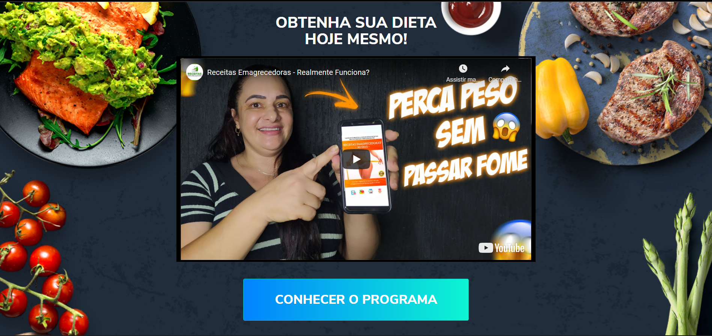
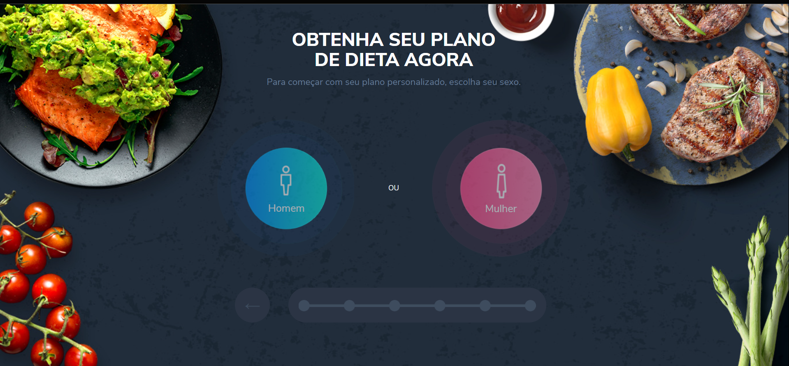
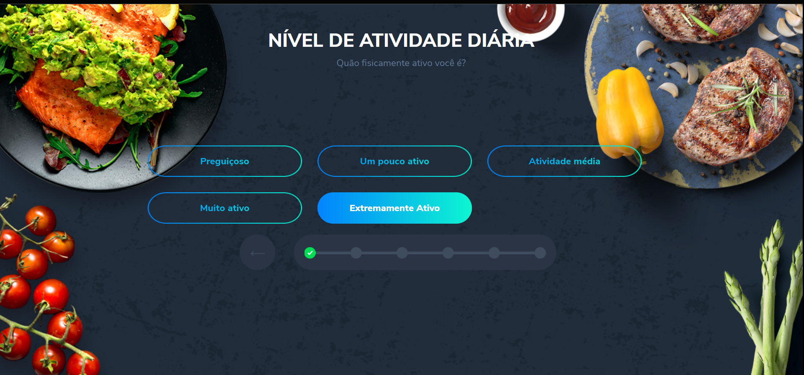
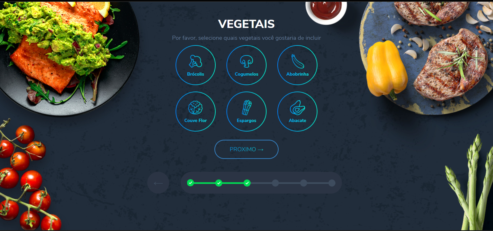
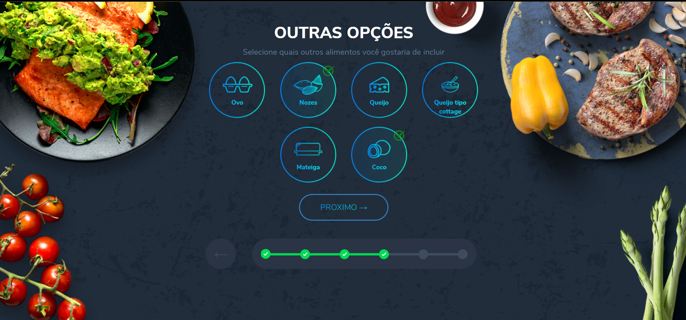
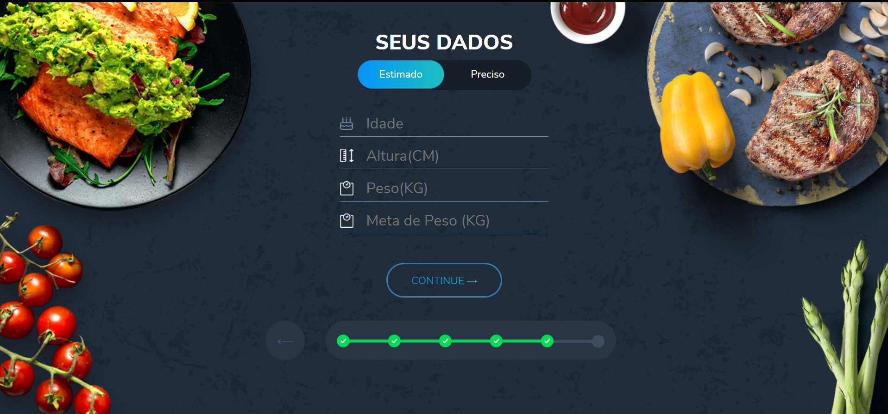
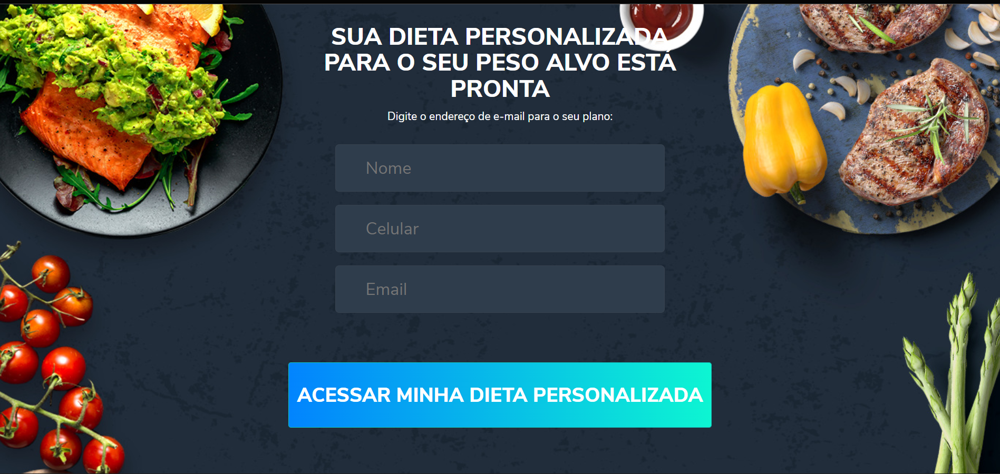

     
     
     
     
     
     
       
         

  <h5 align="center">Landing Page Produto de Emagrecimento</h5>

  

    Projeto desenvolido por Matheus Teodoro
     
    <a href="/">Versão web Pronta</a>
    ·
 
  

# 🎵 Sobre o projeto

Foi desenvolvido com a proposta de uma aplicação web em JS com Jquery

A landing page tem a seguinte estratégia:

-Pagina de Video -> Quiz de Perguntas -> Pagina de Captura de Lead -> Pagina Final de Vendas.

Os dados dos leads capturados são salvos em uma api do shetdb.io

### Stack
- [Jquery](https://jquery.com/)
- [Shetdb](https://sheetdb.io/)

### Layouts

# 🖥️ Para usar

Basta copiar todos os arquivos para seu computador e pronto!